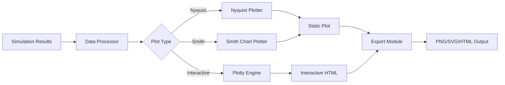

# Product Requirements Document: Advanced Circuit Visualizations

**Feature ID**: #13  
**Feature Name**: Advanced Visualizations - Nyquist, Smith Charts, Interactive Plotly  
**Version**: 1.0  
**Date**: August 27, 2025  
**Author**: Circuit-Sim Development Team  
**Status**: Draft - Pending Approval

## 1. Executive Summary

### 1.1 Overview
This PRD defines the implementation of advanced frequency domain visualization capabilities for the circuit-simulation library, including Nyquist plots, Smith charts, Nichols charts, and interactive Plotly-based visualizations. These tools are essential for professional RF design, control systems analysis, and stability assessment.

### 1.2 Problem Statement
Professional engineers need sophisticated visualization tools beyond basic Bode plots to analyze circuit behavior:
- Control engineers require Nyquist and Nichols plots for stability analysis
- RF engineers need Smith charts for impedance matching and transmission line design
- All users benefit from interactive, web-ready visualizations for detailed analysis
- Current static matplotlib plots limit data exploration and presentation options

### 1.3 Solution Approach
Implement a comprehensive visualization module that provides:
- Industry-standard frequency domain plots (Nyquist, Smith, Nichols)
- Interactive Plotly integration for web-based exploration
- Publication-quality output with professional formatting
- Seamless integration with existing simulation results

## 2. Goals and Non-Goals

### 2.1 Goals
- **G1**: Implement Nyquist plots with stability analysis capabilities
- **G2**: Create Smith charts for RF impedance visualization
- **G3**: Add Nichols charts for control system analysis
- **G4**: Integrate Plotly for interactive, web-ready visualizations
- **G5**: Maintain consistency with existing visualization API
- **G6**: Support export to multiple formats (PNG, SVG, HTML)
- **G7**: Provide hover tooltips and zoom capabilities for data exploration

### 2.2 Non-Goals
- **NG1**: 3D visualizations (future enhancement)
- **NG2**: Real-time streaming plots (separate feature)
- **NG3**: Custom chart types beyond standard engineering plots
- **NG4**: Animation of parameter sweeps (future enhancement)
- **NG5**: Replacement of existing matplotlib plots (complementary feature)

## 3. User Stories

### 3.1 Control Systems Engineer
**As a** control systems engineer  
**I want to** generate Nyquist plots from transfer functions  
**So that I can** assess system stability using the Nyquist criterion  

**Acceptance Criteria:**
- Can plot complex transfer function data on Nyquist diagram
- Automatically marks critical point (-1, 0)
- Calculates encirclements for stability assessment
- Shows both positive and negative frequency responses

### 3.2 RF Design Engineer
**As an** RF engineer  
**I want to** visualize impedance data on Smith charts  
**So that I can** design matching networks and analyze reflection coefficients  

**Acceptance Criteria:**
- Plots impedance trajectories on standard Smith chart grid
- Calculates and displays VSWR values
- Supports multiple impedance traces
- Allows frequency-based color mapping
- Shows constant resistance and reactance circles

### 3.3 Circuit Designer
**As a** circuit designer  
**I want to** create interactive Bode plots with Plotly  
**So that I can** explore frequency response data in detail  

**Acceptance Criteria:**
- Generates interactive magnitude and phase plots
- Supports zoom, pan, and hover for data points
- Displays exact values on hover
- Can export to HTML for web viewing
- Maintains logarithmic frequency scale

### 3.4 Research Engineer
**As a** research engineer  
**I want to** generate publication-quality plots  
**So that I can** include them in technical papers and presentations  

**Acceptance Criteria:**
- Professional formatting with proper labels and units
- High-resolution export options (SVG, PNG)
- Customizable styling (fonts, colors, line styles)
- Proper grid lines and tick marks
- LaTeX rendering support for mathematical labels

## 4. Technical Requirements

### 4.1 Architecture

```
src/circuit_sim/visualization/
├── __init__.py                 # Module exports
├── advanced_plots.py           # Nyquist, Nichols, Polar plots
├── smith_chart.py              # RF impedance Smith chart
├── interactive_plots.py        # Plotly integration
├── plot_utils.py              # Common utilities
└── styles.py                  # Theming and styling
```

### 4.2 Core Components

#### 4.2.1 Nyquist Plot Module
```python
class NyquistPlotter:
    def __init__(self, style: PlotStyle = None):
        """Initialize Nyquist plotter with optional styling."""
        
    def plot(
        self,
        transfer_function: np.ndarray,
        frequencies: np.ndarray,
        title: str = "Nyquist Plot",
        show_stability: bool = True,
        interactive: bool = False
    ) -> PlotResult:
        """Generate Nyquist plot with stability analysis."""
        
    def analyze_stability(
        self,
        real: np.ndarray,
        imag: np.ndarray
    ) -> StabilityAnalysis:
        """Perform Nyquist stability criterion analysis."""
```

#### 4.2.2 Smith Chart Module
```python
class SmithChartPlotter:
    def __init__(self, z0: float = 50.0):
        """Initialize Smith chart with reference impedance."""
        
    def plot(
        self,
        impedances: np.ndarray,
        frequencies: np.ndarray,
        title: str = "Smith Chart",
        show_vswr: bool = True,
        show_admittance: bool = False
    ) -> SmithChartResult:
        """Generate Smith chart visualization."""
        
    def add_matching_network(
        self,
        components: List[Component]
    ) -> None:
        """Add matching network visualization."""
```

#### 4.2.3 Interactive Plot Module
```python
class InteractivePlotter:
    def __init__(self, theme: str = "plotly_white"):
        """Initialize Plotly plotter with theme."""
        
    def create_bode_plot(
        self,
        results: SimulationResults,
        signals: List[str],
        title: str = "Bode Plot"
    ) -> str:
        """Create interactive Bode plot HTML."""
        
    def create_nyquist_plot(
        self,
        transfer_function: np.ndarray,
        frequencies: np.ndarray
    ) -> str:
        """Create interactive Nyquist plot."""
        
    def create_smith_chart(
        self,
        impedances: np.ndarray,
        frequencies: np.ndarray
    ) -> str:
        """Create interactive Smith chart."""
```

### 4.3 API Design

#### 4.3.1 Simple API Usage
```python
from circuit_sim.visualization import plot_nyquist, plot_smith_chart
from circuit_sim.simulation import SimulationResults

# Basic Nyquist plot
results = simulator.run_ac_analysis(circuit)
nyquist_data = plot_nyquist(
    results.transfer_function("Vout", "Vin"),
    results.frequencies
)

# Basic Smith chart
smith_data = plot_smith_chart(
    results.impedance("Z1"),
    results.frequencies,
    z0=50.0
)
```

#### 4.3.2 Advanced API Usage
```python
from circuit_sim.visualization import VisualizationEngine

# Create visualization engine with custom styling
viz = VisualizationEngine(
    style="professional",
    interactive=True,
    export_dpi=300
)

# Generate multiple plot types
plots = viz.create_analysis_suite(
    results,
    plot_types=["bode", "nyquist", "smith"],
    signals=["V(out)", "V(feedback)"]
)

# Export to different formats
viz.export(plots, format="html", filename="analysis.html")
viz.export(plots, format="svg", filename="analysis.svg")
```

### 4.4 Data Flow



## 5. Implementation Plan

### 5.1 Phase 1: Core Infrastructure (Day 1, Hours 1-4)
- [ ] Create visualization module structure
- [ ] Implement base plotter classes
- [ ] Set up styling and theming system
- [ ] Create common utilities (grids, axes, labels)

### 5.2 Phase 2: Nyquist Implementation (Day 1, Hours 5-8)
- [ ] Implement NyquistPlotter class
- [ ] Add stability analysis algorithms
- [ ] Create encirclement counting logic
- [ ] Add critical point marking
- [ ] Implement negative frequency mirroring

### 5.3 Phase 3: Smith Chart Implementation (Day 2, Hours 1-4)
- [ ] Implement SmithChartPlotter class
- [ ] Create Smith grid generation (resistance/reactance circles)
- [ ] Add reflection coefficient calculations
- [ ] Implement VSWR calculations
- [ ] Add impedance-to-admittance conversion

### 5.4 Phase 4: Plotly Integration (Day 2, Hours 5-8)
- [ ] Set up Plotly dependencies
- [ ] Implement InteractivePlotter class
- [ ] Create interactive Bode plots
- [ ] Add interactive Nyquist plots
- [ ] Implement interactive Smith charts
- [ ] Add hover tooltips and zoom capabilities

### 5.5 Phase 5: Testing & Documentation (Day 2, Final Hours)
- [ ] Write unit tests for all plotters
- [ ] Create integration tests with simulation results
- [ ] Add example notebooks
- [ ] Write API documentation
- [ ] Create user guide with examples

## 6. Testing Strategy

### 6.1 Unit Tests
```python
def test_nyquist_stability_analysis():
    """Test Nyquist stability criterion calculations."""
    # Create known stable/unstable transfer functions
    # Verify encirclement counting
    # Check critical point detection
    
def test_smith_chart_calculations():
    """Test Smith chart impedance transformations."""
    # Verify reflection coefficient calculations
    # Test VSWR calculations
    # Check impedance-to-admittance conversion
    
def test_plotly_html_generation():
    """Test interactive plot HTML generation."""
    # Verify HTML structure
    # Check JavaScript inclusion
    # Test data embedding
```

### 6.2 Integration Tests
- Test with real simulation results
- Verify plot generation from various circuit types
- Test export functionality for all formats
- Validate interactive features in generated HTML

### 6.3 Performance Tests
- Plot generation time < 2 seconds for 10,000 data points
- HTML file size < 5MB for typical plots
- Memory usage < 100MB for complex visualizations

## 7. Success Metrics

### 7.1 Functional Metrics
- ✅ All plot types generate without errors
- ✅ Stability analysis correctly identifies stable/unstable systems
- ✅ Smith charts accurately represent impedance data
- ✅ Interactive plots work in major browsers (Chrome, Firefox, Safari)
- ✅ Export functionality works for PNG, SVG, HTML formats

### 7.2 Quality Metrics
- Code coverage > 90% for visualization module
- All public APIs documented with examples
- Performance benchmarks met (< 2s generation time)
- Professional formatting standards maintained
- Zero critical bugs in production

### 7.3 User Metrics
- Engineers can generate publication-quality plots
- RF designers successfully use Smith charts for matching
- Control engineers accurately assess stability
- Interactive plots enhance data exploration capabilities

## 8. Risks and Mitigations

### 8.1 Technical Risks
| Risk | Impact | Probability | Mitigation |
|------|--------|-------------|------------|
| Plotly dependency conflicts | High | Low | Pin specific versions, test thoroughly |
| Complex Smith chart math | Medium | Medium | Use established algorithms, extensive testing |
| Browser compatibility issues | Medium | Low | Test on multiple browsers, use CDN Plotly |
| Performance with large datasets | Medium | Medium | Implement data decimation, lazy loading |

### 8.2 Implementation Risks
| Risk | Impact | Probability | Mitigation |
|------|--------|-------------|------------|
| Scope creep | High | Medium | Stick to defined plot types, defer enhancements |
| Integration complexity | Medium | Low | Design clean interfaces, maintain separation |
| Testing complexity | Low | Medium | Use parametrized tests, create test fixtures |

## 9. Dependencies

### 9.1 Technical Dependencies
- **Required**: NumPy, Matplotlib (existing)
- **New**: Plotly (>=5.0.0)
- **Optional**: SciPy for advanced calculations
- **Build**: No changes to build system required

### 9.2 Feature Dependencies
- **Depends On**: AC frequency analysis (Issue #6) - ✅ Complete
- **Enhanced By**: Transfer function analysis (Issue #12) - Optional
- **Enables**: Professional RF design workflows
- **Complements**: Existing report generation system

## 10. Security Considerations

### 10.1 Input Validation
- Validate all numerical inputs for NaN/Inf
- Sanitize plot titles and labels for HTML injection
- Limit data array sizes to prevent DoS
- Validate frequency ranges for physical validity

### 10.2 Export Security
- Sanitize filenames for export operations
- Validate export paths to prevent directory traversal
- Limit HTML file sizes to prevent resource exhaustion
- Use CDN for Plotly JS to avoid bundling vulnerabilities

## 11. Documentation Requirements

### 11.1 API Documentation
- Comprehensive docstrings for all public methods
- Type hints for all parameters and returns
- Examples for each plot type
- Integration guide with simulation results

### 11.2 User Documentation
- Tutorial: "Creating Your First Nyquist Plot"
- Guide: "Smith Charts for RF Design"
- Reference: "Interactive Visualization API"
- Examples: Jupyter notebooks for each plot type

### 11.3 Developer Documentation
- Architecture overview
- Algorithm explanations
- Testing guide
- Contributing guidelines

## 12. Future Enhancements

### 12.1 Next Phase (v2.0)
- 3D visualizations for multi-parameter sweeps
- Animation support for parameter variations
- Real-time streaming plot updates
- Custom chart types via plugin system

### 12.2 Long-term Vision
- AI-assisted plot interpretation
- Automatic report generation from plots
- Integration with CAD tools
- Cloud-based collaborative visualization

## 13. Approval

### 13.1 Stakeholders
- **Engineering Lead**: [Pending]
- **Product Owner**: [Pending]
- **Technical Reviewer**: [Pending]

### 13.2 Sign-off Criteria
- [ ] Technical approach approved
- [ ] API design reviewed
- [ ] Testing strategy accepted
- [ ] Timeline agreed upon
- [ ] Dependencies approved

## 14. Appendix

### 14.1 Example Code Snippets

#### Nyquist Plot Example
```python
# Analyze amplifier stability
circuit = Circuit("Operational Amplifier")
results = simulator.run_ac_analysis(
    circuit,
    start_freq=1,
    stop_freq=1e6,
    points_per_decade=50
)

# Generate Nyquist plot with stability analysis
from circuit_sim.visualization import plot_nyquist

nyquist_result = plot_nyquist(
    transfer_function=results.transfer_function("Vout", "Vin"),
    frequencies=results.frequencies,
    title="Op-Amp Stability Analysis",
    show_stability=True,
    interactive=True
)

print(f"System is {'stable' if nyquist_result.stable else 'unstable'}")
print(f"Encirclements of (-1,0): {nyquist_result.encirclements}")
```

#### Smith Chart Example
```python
# Design impedance matching network
from circuit_sim.visualization import SmithChartPlotter

plotter = SmithChartPlotter(z0=50.0)  # 50Ω reference

# Plot impedance trajectory
smith_result = plotter.plot(
    impedances=results.impedance("Z_antenna"),
    frequencies=results.frequencies,
    title="Antenna Impedance Matching",
    show_vswr=True
)

# Add matching network visualization
plotter.add_matching_network([
    Component("L", 10e-9),  # 10nH inductor
    Component("C", 5e-12)   # 5pF capacitor
])

print(f"Best VSWR: {smith_result.min_vswr:.2f}")
print(f"At frequency: {smith_result.best_match_freq:.2f} MHz")
```

#### Interactive Plotly Example
```python
from circuit_sim.visualization import InteractivePlotter

# Create interactive visualization engine
plotter = InteractivePlotter(theme="plotly_dark")

# Generate interactive multi-trace Bode plot
html_output = plotter.create_bode_plot(
    results=results,
    signals=["V(out)", "V(feedback)", "V(error)"],
    title="Multi-Stage Amplifier Frequency Response"
)

# Save to HTML file for web viewing
with open("amplifier_analysis.html", "w") as f:
    f.write(html_output)

# Or embed in Jupyter notebook
from IPython.display import HTML
display(HTML(html_output))
```

### 14.2 References
- [Nyquist Stability Criterion](https://en.wikipedia.org/wiki/Nyquist_stability_criterion)
- [Smith Chart Fundamentals](https://www.microwaves101.com/encyclopedias/smith-chart)
- [Nichols Chart Theory](https://en.wikipedia.org/wiki/Nichols_plot)
- [Plotly Python Documentation](https://plotly.com/python/)
- [IEEE Std 1057-2017](https://standards.ieee.org/standard/1057-2017.html) - Digitizing Waveform Recorders

### 14.3 Glossary
- **Nyquist Plot**: Parametric plot of a frequency response in the complex plane
- **Smith Chart**: Graphical tool for RF impedance calculations
- **Nichols Chart**: Plot of phase versus magnitude for control system design
- **VSWR**: Voltage Standing Wave Ratio, measure of impedance matching
- **Transfer Function**: H(jω) = Output/Input in frequency domain
- **Reflection Coefficient**: Γ = (Z - Z₀)/(Z + Z₀)
- **Encirclement**: Complete loop around a point in the complex plane

---

**Document Status**: DRAFT - Awaiting Approval  
**Last Updated**: August 27, 2025  
**Next Review**: Upon stakeholder feedback